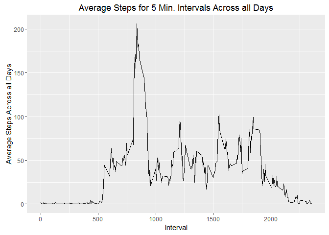
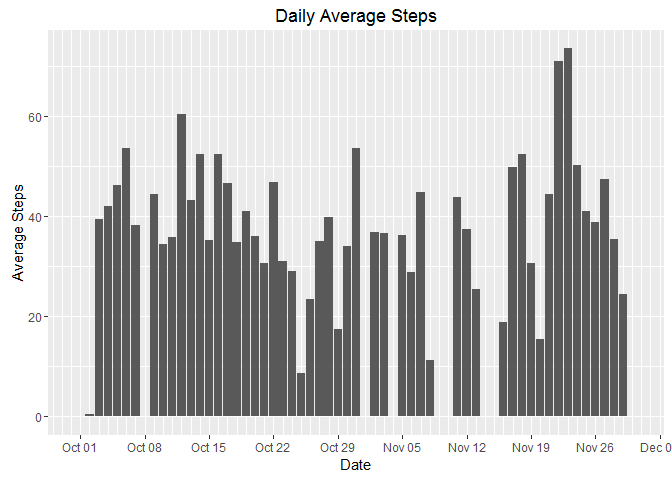
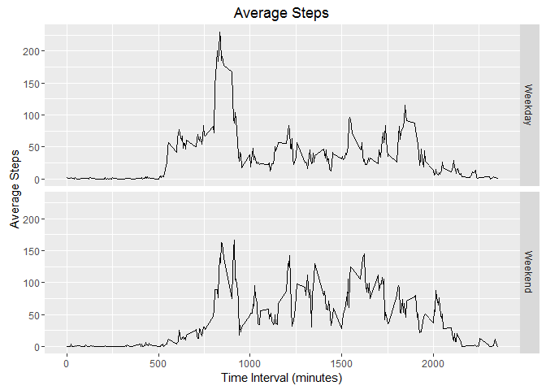

# Reproducible Research: Peer Assessment 1


## Loading and preprocessing the data

### Loading Required Libraries


```r
library("knitr")
library("ggplot2")
library("plyr")
```

### Loading Activity Data


```r
activityData = read.csv("activity.csv")
```

### Addding Corresponding Days for Each Date in the Data


```r
activityData$days = weekdays(as.Date(activityData$date,format = "%Y-%m-%d"))
```

## What is mean total number of steps taken per day?

### Daily Average and Median Steps

#### Daily Average Steps


```r
dailyAverage = ddply(activityData, .(date), summarise, steps = mean(steps))
dailyAverage$date = as.Date(dailyAverage$date,format = "%Y-%m-%d")
knitr::kable(dailyAverage)
```


date               steps
-----------  -----------
2012-10-01            NA
2012-10-02     0.4375000
2012-10-03    39.4166667
2012-10-04    42.0694444
2012-10-05    46.1597222
2012-10-06    53.5416667
2012-10-07    38.2465278
2012-10-08            NA
2012-10-09    44.4826389
2012-10-10    34.3750000
2012-10-11    35.7777778
2012-10-12    60.3541667
2012-10-13    43.1458333
2012-10-14    52.4236111
2012-10-15    35.2048611
2012-10-16    52.3750000
2012-10-17    46.7083333
2012-10-18    34.9166667
2012-10-19    41.0729167
2012-10-20    36.0937500
2012-10-21    30.6284722
2012-10-22    46.7361111
2012-10-23    30.9652778
2012-10-24    29.0104167
2012-10-25     8.6527778
2012-10-26    23.5347222
2012-10-27    35.1354167
2012-10-28    39.7847222
2012-10-29    17.4236111
2012-10-30    34.0937500
2012-10-31    53.5208333
2012-11-01            NA
2012-11-02    36.8055556
2012-11-03    36.7048611
2012-11-04            NA
2012-11-05    36.2465278
2012-11-06    28.9375000
2012-11-07    44.7326389
2012-11-08    11.1770833
2012-11-09            NA
2012-11-10            NA
2012-11-11    43.7777778
2012-11-12    37.3784722
2012-11-13    25.4722222
2012-11-14            NA
2012-11-15     0.1423611
2012-11-16    18.8923611
2012-11-17    49.7881944
2012-11-18    52.4652778
2012-11-19    30.6979167
2012-11-20    15.5277778
2012-11-21    44.3993056
2012-11-22    70.9270833
2012-11-23    73.5902778
2012-11-24    50.2708333
2012-11-25    41.0902778
2012-11-26    38.7569444
2012-11-27    47.3819444
2012-11-28    35.3576389
2012-11-29    24.4687500
2012-11-30            NA

#### Daily Median Steps


```r
dailyMedian = ddply(activityData, .(date), summarise, steps = median(steps))
dailyMedian$date = as.Date(dailyMedian$date,format = "%Y-%m-%d")
knitr::kable(dailyMedian)
```


date          steps
-----------  ------
2012-10-01       NA
2012-10-02        0
2012-10-03        0
2012-10-04        0
2012-10-05        0
2012-10-06        0
2012-10-07        0
2012-10-08       NA
2012-10-09        0
2012-10-10        0
2012-10-11        0
2012-10-12        0
2012-10-13        0
2012-10-14        0
2012-10-15        0
2012-10-16        0
2012-10-17        0
2012-10-18        0
2012-10-19        0
2012-10-20        0
2012-10-21        0
2012-10-22        0
2012-10-23        0
2012-10-24        0
2012-10-25        0
2012-10-26        0
2012-10-27        0
2012-10-28        0
2012-10-29        0
2012-10-30        0
2012-10-31        0
2012-11-01       NA
2012-11-02        0
2012-11-03        0
2012-11-04       NA
2012-11-05        0
2012-11-06        0
2012-11-07        0
2012-11-08        0
2012-11-09       NA
2012-11-10       NA
2012-11-11        0
2012-11-12        0
2012-11-13        0
2012-11-14       NA
2012-11-15        0
2012-11-16        0
2012-11-17        0
2012-11-18        0
2012-11-19        0
2012-11-20        0
2012-11-21        0
2012-11-22        0
2012-11-23        0
2012-11-24        0
2012-11-25        0
2012-11-26        0
2012-11-27        0
2012-11-28        0
2012-11-29        0
2012-11-30       NA

### Plotting Daily Average Steps Histogram


```r
g = ggplot(dailyAverage, aes(date,steps))
g + geom_bar(stat = 'identity', position = 'dodge') +
        scale_x_date(date_breaks = "1 week", date_labels = "%b %d", date_minor_breaks = "1 day") +
        labs(x = 'Date') + 
        labs(y = 'Average Steps') +
        labs(title = 'Daily Average Steps')
```


## What is the average daily activity pattern?

### Time Series Plot of Interval and the Average Number of Steps Taken, Averaged Across all Days


```r
intAvg = ddply(na.omit(activityData), .(interval), summarise, steps = mean(steps))

g = ggplot(intAvg, aes(x = interval, y = steps))
g + geom_line(size = 0.7) + 
    labs(x = 'Interval') + 
    labs(y = 'Average Steps Across all Days') +
    labs(title = 'Average Steps for 5 Min. Intervals Across all Days')
```


    
### Interval, on Average Across all Days, Containing Maximum Number of Steps


```r
intAvg$interval[which.max(intAvg$steps)]
```

```
## [1] 835
```

## Imputing missing values

### Total Number of Missing Values in the Dataset


```r
sum(is.na(activityData$steps)==TRUE)
```

```
## [1] 2304
```

### Imputing Missing Data

Imputing missing values using 5-minute interval average across all days for which data is available.


```r
impActData = activityData

for(i in 1:nrow(impActData)){
        
        if(is.na(impActData[i,1])){
                
                impActData[i,1] = intAvg$steps[which(intAvg$interval == impActData$interval[i])]
                
        }
        
}
```

### Daily Average and Median Steps


```r
dailyImpAverage = ddply(impActData, .(date), summarise, steps = mean(steps))
dailyImpAverage$date = as.Date(dailyImpAverage$date,format = "%Y-%m-%d")
knitr::kable(dailyImpAverage)
```


date               steps
-----------  -----------
2012-10-01    37.3825996
2012-10-02     0.4375000
2012-10-03    39.4166667
2012-10-04    42.0694444
2012-10-05    46.1597222
2012-10-06    53.5416667
2012-10-07    38.2465278
2012-10-08    37.3825996
2012-10-09    44.4826389
2012-10-10    34.3750000
2012-10-11    35.7777778
2012-10-12    60.3541667
2012-10-13    43.1458333
2012-10-14    52.4236111
2012-10-15    35.2048611
2012-10-16    52.3750000
2012-10-17    46.7083333
2012-10-18    34.9166667
2012-10-19    41.0729167
2012-10-20    36.0937500
2012-10-21    30.6284722
2012-10-22    46.7361111
2012-10-23    30.9652778
2012-10-24    29.0104167
2012-10-25     8.6527778
2012-10-26    23.5347222
2012-10-27    35.1354167
2012-10-28    39.7847222
2012-10-29    17.4236111
2012-10-30    34.0937500
2012-10-31    53.5208333
2012-11-01    37.3825996
2012-11-02    36.8055556
2012-11-03    36.7048611
2012-11-04    37.3825996
2012-11-05    36.2465278
2012-11-06    28.9375000
2012-11-07    44.7326389
2012-11-08    11.1770833
2012-11-09    37.3825996
2012-11-10    37.3825996
2012-11-11    43.7777778
2012-11-12    37.3784722
2012-11-13    25.4722222
2012-11-14    37.3825996
2012-11-15     0.1423611
2012-11-16    18.8923611
2012-11-17    49.7881944
2012-11-18    52.4652778
2012-11-19    30.6979167
2012-11-20    15.5277778
2012-11-21    44.3993056
2012-11-22    70.9270833
2012-11-23    73.5902778
2012-11-24    50.2708333
2012-11-25    41.0902778
2012-11-26    38.7569444
2012-11-27    47.3819444
2012-11-28    35.3576389
2012-11-29    24.4687500
2012-11-30    37.3825996

### Daily Median Steps


```r
dailyImpMedian = ddply(impActData, .(date), summarise, steps = median(steps))
dailyImpMedian$date = as.Date(dailyImpMedian$date,format = "%Y-%m-%d")
knitr::kable(dailyImpMedian)
```


date             steps
-----------  ---------
2012-10-01    34.11321
2012-10-02     0.00000
2012-10-03     0.00000
2012-10-04     0.00000
2012-10-05     0.00000
2012-10-06     0.00000
2012-10-07     0.00000
2012-10-08    34.11321
2012-10-09     0.00000
2012-10-10     0.00000
2012-10-11     0.00000
2012-10-12     0.00000
2012-10-13     0.00000
2012-10-14     0.00000
2012-10-15     0.00000
2012-10-16     0.00000
2012-10-17     0.00000
2012-10-18     0.00000
2012-10-19     0.00000
2012-10-20     0.00000
2012-10-21     0.00000
2012-10-22     0.00000
2012-10-23     0.00000
2012-10-24     0.00000
2012-10-25     0.00000
2012-10-26     0.00000
2012-10-27     0.00000
2012-10-28     0.00000
2012-10-29     0.00000
2012-10-30     0.00000
2012-10-31     0.00000
2012-11-01    34.11321
2012-11-02     0.00000
2012-11-03     0.00000
2012-11-04    34.11321
2012-11-05     0.00000
2012-11-06     0.00000
2012-11-07     0.00000
2012-11-08     0.00000
2012-11-09    34.11321
2012-11-10    34.11321
2012-11-11     0.00000
2012-11-12     0.00000
2012-11-13     0.00000
2012-11-14    34.11321
2012-11-15     0.00000
2012-11-16     0.00000
2012-11-17     0.00000
2012-11-18     0.00000
2012-11-19     0.00000
2012-11-20     0.00000
2012-11-21     0.00000
2012-11-22     0.00000
2012-11-23     0.00000
2012-11-24     0.00000
2012-11-25     0.00000
2012-11-26     0.00000
2012-11-27     0.00000
2012-11-28     0.00000
2012-11-29     0.00000
2012-11-30    34.11321

### Plotting Daily Average Steps Histogram for Imputed Data


```r
g = ggplot(dailyAverage, aes(date,steps))
g + geom_bar(stat = 'identity', position = 'dodge') +
        scale_x_date(date_breaks = "1 week", date_labels = "%b %d", date_minor_breaks = "1 day") +
        labs(x = 'Date') + 
        labs(y = 'Average Steps') +
        labs(title = 'Daily Average Steps')
```



### Difference Between Imputed and Actual Data

#### Difference in Average Values


```r
diffData = dailyAverage
diffData$steps = NULL

diffData$`Difference Between Imputed and Actual Data` = abs(dailyImpAverage$steps - dailyAverage$steps)
knitr::kable(na.omit(diffData))
```

     date          Difference Between Imputed and Actual Data
---  -----------  -------------------------------------------
2    2012-10-02                                             0
3    2012-10-03                                             0
4    2012-10-04                                             0
5    2012-10-05                                             0
6    2012-10-06                                             0
7    2012-10-07                                             0
9    2012-10-09                                             0
10   2012-10-10                                             0
11   2012-10-11                                             0
12   2012-10-12                                             0
13   2012-10-13                                             0
14   2012-10-14                                             0
15   2012-10-15                                             0
16   2012-10-16                                             0
17   2012-10-17                                             0
18   2012-10-18                                             0
19   2012-10-19                                             0
20   2012-10-20                                             0
21   2012-10-21                                             0
22   2012-10-22                                             0
23   2012-10-23                                             0
24   2012-10-24                                             0
25   2012-10-25                                             0
26   2012-10-26                                             0
27   2012-10-27                                             0
28   2012-10-28                                             0
29   2012-10-29                                             0
30   2012-10-30                                             0
31   2012-10-31                                             0
33   2012-11-02                                             0
34   2012-11-03                                             0
36   2012-11-05                                             0
37   2012-11-06                                             0
38   2012-11-07                                             0
39   2012-11-08                                             0
42   2012-11-11                                             0
43   2012-11-12                                             0
44   2012-11-13                                             0
46   2012-11-15                                             0
47   2012-11-16                                             0
48   2012-11-17                                             0
49   2012-11-18                                             0
50   2012-11-19                                             0
51   2012-11-20                                             0
52   2012-11-21                                             0
53   2012-11-22                                             0
54   2012-11-23                                             0
55   2012-11-24                                             0
56   2012-11-25                                             0
57   2012-11-26                                             0
58   2012-11-27                                             0
59   2012-11-28                                             0
60   2012-11-29                                             0

#### Difference in Median Values


```r
diffData$date = dailyAverage$date
diffData$`Difference Between Imputed and Actual Data` = abs(dailyImpAverage$steps - dailyAverage$steps)
knitr::kable(na.omit(diffData))
```

     date          Difference Between Imputed and Actual Data
---  -----------  -------------------------------------------
2    2012-10-02                                             0
3    2012-10-03                                             0
4    2012-10-04                                             0
5    2012-10-05                                             0
6    2012-10-06                                             0
7    2012-10-07                                             0
9    2012-10-09                                             0
10   2012-10-10                                             0
11   2012-10-11                                             0
12   2012-10-12                                             0
13   2012-10-13                                             0
14   2012-10-14                                             0
15   2012-10-15                                             0
16   2012-10-16                                             0
17   2012-10-17                                             0
18   2012-10-18                                             0
19   2012-10-19                                             0
20   2012-10-20                                             0
21   2012-10-21                                             0
22   2012-10-22                                             0
23   2012-10-23                                             0
24   2012-10-24                                             0
25   2012-10-25                                             0
26   2012-10-26                                             0
27   2012-10-27                                             0
28   2012-10-28                                             0
29   2012-10-29                                             0
30   2012-10-30                                             0
31   2012-10-31                                             0
33   2012-11-02                                             0
34   2012-11-03                                             0
36   2012-11-05                                             0
37   2012-11-06                                             0
38   2012-11-07                                             0
39   2012-11-08                                             0
42   2012-11-11                                             0
43   2012-11-12                                             0
44   2012-11-13                                             0
46   2012-11-15                                             0
47   2012-11-16                                             0
48   2012-11-17                                             0
49   2012-11-18                                             0
50   2012-11-19                                             0
51   2012-11-20                                             0
52   2012-11-21                                             0
53   2012-11-22                                             0
54   2012-11-23                                             0
55   2012-11-24                                             0
56   2012-11-25                                             0
57   2012-11-26                                             0
58   2012-11-27                                             0
59   2012-11-28                                             0
60   2012-11-29                                             0

## Are there differences in activity patterns between weekdays and weekends?

### Creating Weekday and Weekend Data


```r
days = c("Monday", "Tuesday", "Wednesday", "Thursday", "Friday", "Saturday", "Sunday")

weekdayData = impActData[impActData$days %in% days[1:5],]
weekendData = impActData[impActData$days %in% days[6:7],]

weekdayAvg = ddply(weekdayData, .(interval), summarise, steps = mean(steps))
weekdayAvg$day = "Weekday"

weekendAvg = ddply(weekendData, .(interval), summarise, steps = mean(steps))
weekendAvg$day = "Weekend"

avgDayActivityData = rbind(weekdayAvg,weekendAvg)
```

### Plotting Weekday and Weekend Panel Plots


```r
g = ggplot(avgDayActivityData, aes(x=interval,y=steps))
g + geom_line(size=0.7)+
    labs(x = 'Time Interval (minutes)') + 
    labs(y = 'Average Steps') +
    labs(title = 'Average Steps')+
    facet_grid(day~.)
```


